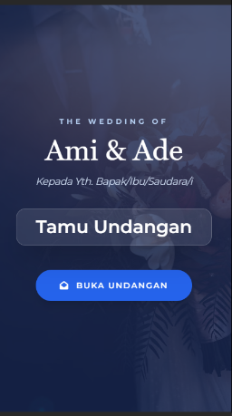
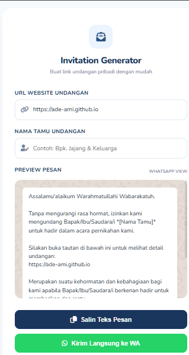

# 💌 Ami & Ade Digital Wedding Invitation

Sebuah proyek undangan pernikahan digital yang elegan, responsif, dan interaktif. Dibuat khusus untuk momen bahagia **Ami & Ade**, undangan ini dirancang untuk memberikan pengalaman terbaik bagi para tamu undangan menggunakan GitHub Pages.

---

## ✨ Fitur Utama

Proyek ini dilengkapi dengan berbagai fitur modern:

* **🎯 Smart WhatsApp Generator**: Kirim undangan personal tanpa ribet. Nama tamu akan muncul otomatis di halaman depan berdasarkan parameter URL.
* **🎵 Background Music**: Fitur pemutaran musik otomatis (*autoplay*) untuk memperkuat suasana romantis.
* **📸 Interactive Gallery**: Galeri foto yang bersih dengan fitur *zoom* dan *lightbox*.
* **✍️ Real-time Guestbook**: Buku tamu interaktif menggunakan database (Supabase) agar tamu bisa mengirim doa secara langsung.
* **📅 Save the Date**: Fitur pengingat kalender agar tamu tidak melewatkan hari bahagia ini.

---

## 📸 Preview Tampilan

Berikut adalah cuplikan tampilan undangan:

  

---

## 🚀 Cara Penggunaan Generator Nama 

  

Untuk memasukkan nama tamu yang akan diundang agar muncul secara otomatis di halaman sampul, silakan gunakan link generator berikut:

[https://ade-ami.github.io/generator.html](https://ade-ami.github.io/generator.html)

---

## 🛠️ Konfigurasi Supabase (Database Guestbook)
Untuk mengaktifkan fitur buku tamu, silakan salin dan tempel perintah berikut ke dalam SQL Editor di Dashboard Supabase Anda:

1. Membuat Tabel Guestbook
Gunakan kode ini untuk membuat tabel dengan kolom yang sesuai dengan fungsi entry di JavaScript:

SQL
<button _ngcontent-ng-c3186109008="" aria-label="Salin kode" mat-icon-button="" mattooltip="Salin kode" class="mdc-icon-button mat-mdc-icon-button mat-mdc-button-base mat-mdc-tooltip-trigger copy-button ng-tns-c3186109008-296 mat-unthemed ng-star-inserted" mat-ripple-loader-class-name="mat-mdc-button-ripple" mat-ripple-loader-centered="" jslog="179062;track:generic_click,impression;BardVeMetadataKey:[[&quot;r_fa4001de816eec58&quot;,&quot;c_649b4c73a47bc21c&quot;,null,&quot;rc_e318524f2ef909d9&quot;,null,null,&quot;id&quot;,null,1,null,null,1,0]];mutable:true"><mat-icon _ngcontent-ng-c3186109008="" role="img" fonticon="content_copy" class="mat-icon notranslate gds-icon-s google-symbols mat-ligature-font mat-icon-no-color" aria-hidden="true" data-mat-icon-type="font" data-mat-icon-name="content_copy"></mat-icon></button><!----><!---->
<!---->
<!---->

<pre _ngcontent-ng-c3186109008="" class="ng-tns-c3186109008-296"><code _ngcontent-ng-c3186109008="" role="text" data-test-id="code-content" class="code-container formatted ng-tns-c3186109008-296">-- Membuat tabel pesan/buku tamu
CREATE TABLE guestbook (
  id bigint primary key generated always as identity,
  name text not null,
  message text not null,
  created_at timestamptz default now()
);

-- Mengaktifkan akses publik (Insert &amp; Select) 
-- Pastikan untuk mengatur Policy di bagian Authentication &gt; Policies
</code></pre><!---->

-- Aktifkan Row Level Security (RLS)
alter table guestbook enable row level security;

2. Mengatur Izin Akses (Policies)
Berikan izin agar pengunjung (anonim) bisa membaca dan mengirim ucapan:

SQL
<button _ngcontent-ng-c3186109008="" aria-label="Salin kode" mat-icon-button="" mattooltip="Salin kode" class="mdc-icon-button mat-mdc-icon-button mat-mdc-button-base mat-mdc-tooltip-trigger copy-button ng-tns-c3186109008-326 mat-unthemed ng-star-inserted" mat-ripple-loader-class-name="mat-mdc-button-ripple" mat-ripple-loader-centered="" jslog="179062;track:generic_click,impression;BardVeMetadataKey:[[&quot;r_dd6721f3aa884f8e&quot;,&quot;c_dc44b2989e469fcc&quot;,null,&quot;rc_4eda05437c5cd393&quot;,null,null,&quot;id&quot;,null,1,null,null,1,0]];mutable:true"><mat-icon _ngcontent-ng-c3186109008="" role="img" fonticon="content_copy" class="mat-icon notranslate gds-icon-s google-symbols mat-ligature-font mat-icon-no-color" aria-hidden="true" data-mat-icon-type="font" data-mat-icon-name="content_copy"></mat-icon></button><!----><!---->
<!---->
<!---->

<pre _ngcontent-ng-c3186109008="" class="ng-tns-c3186109008-326"><code _ngcontent-ng-c3186109008="" role="text" data-test-id="code-content" class="code-container formatted ng-tns-c3186109008-326">-- Izinkan semua orang (anonim) untuk melihat ucapan
create policy "Siapa pun bisa melihat ucapan" 
on guestbook for select 
using (true);

-- Izinkan semua orang (anonim) untuk mengirim ucapan
create policy "Siapa pun bisa mengirim ucapan" 
on guestbook for insert 
with check (true);
</code></pre><!---->

-- Izinkan semua orang (anonim) untuk mengirim ucapan
create policy "Siapa pun bisa mengirim ucapan" 
on guestbook for insert 
with check (true);
💡 Tips Integrasi
Ganti Credentials: Masukkan SUPABASE_URL dan SUPABASE_ANON_KEY asli dari menu Project Settings > API ke dalam file JavaScript Anda.

Case Sensitivity: Perhatikan penggunaan tanda kutip dua (contoh: "Nama") pada SQL agar sesuai dengan variabel JavaScript yang menggunakan huruf kapital di depan.

---

## 📂 Struktur Folder

Plaintext
<button _ngcontent-ng-c3186109008="" aria-label="Salin kode" mat-icon-button="" mattooltip="Salin kode" class="mdc-icon-button mat-mdc-icon-button mat-mdc-button-base mat-mdc-tooltip-trigger copy-button ng-tns-c3186109008-356 mat-unthemed ng-star-inserted" mat-ripple-loader-uninitialized="" mat-ripple-loader-class-name="mat-mdc-button-ripple" mat-ripple-loader-centered="" jslog="179062;track:generic_click,impression;BardVeMetadataKey:[[&quot;r_0cec7c5953ada691&quot;,&quot;c_649b4c73a47bc21c&quot;,null,&quot;rc_246e8b5d48528c7b&quot;,null,null,&quot;id&quot;,null,1,null,null,1,0]];mutable:true"><mat-icon _ngcontent-ng-c3186109008="" role="img" fonticon="content_copy" class="mat-icon notranslate gds-icon-s google-symbols mat-ligature-font mat-icon-no-color" aria-hidden="true" data-mat-icon-type="font" data-mat-icon-name="content_copy"></mat-icon></button><!----><!---->
<!---->
<!---->

<pre _ngcontent-ng-c3186109008="" class="ng-tns-c3186109008-356"><code _ngcontent-ng-c3186109008="" role="text" data-test-id="code-content" class="code-container formatted ng-tns-c3186109008-356">├── index.html          # Halaman utama undangan
├── generator.html      # Halaman generator nama tamu
├── css/                # File styling
├── js/                 # Logika interaksi &amp; integrasi Supabase
├── img/                # Asset gambar &amp; galeri
└── audio/              # Background music (mp3)
</code></pre><!---->

---

## 📜 Lisensi
Proyek ini dilisensikan di bawah MIT License.

Dibuat dengan ❤️ untuk Ami & Ade.
